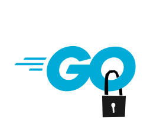
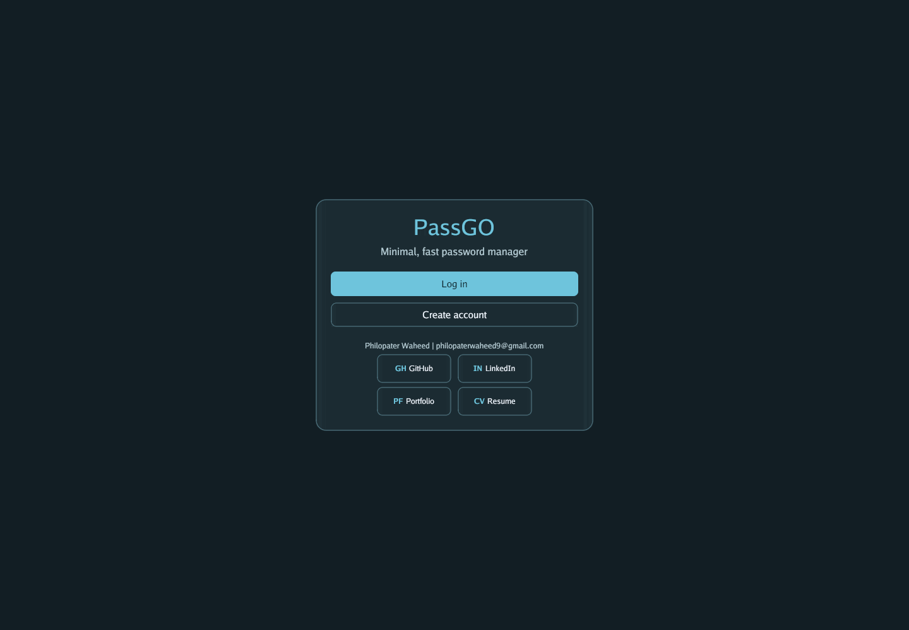
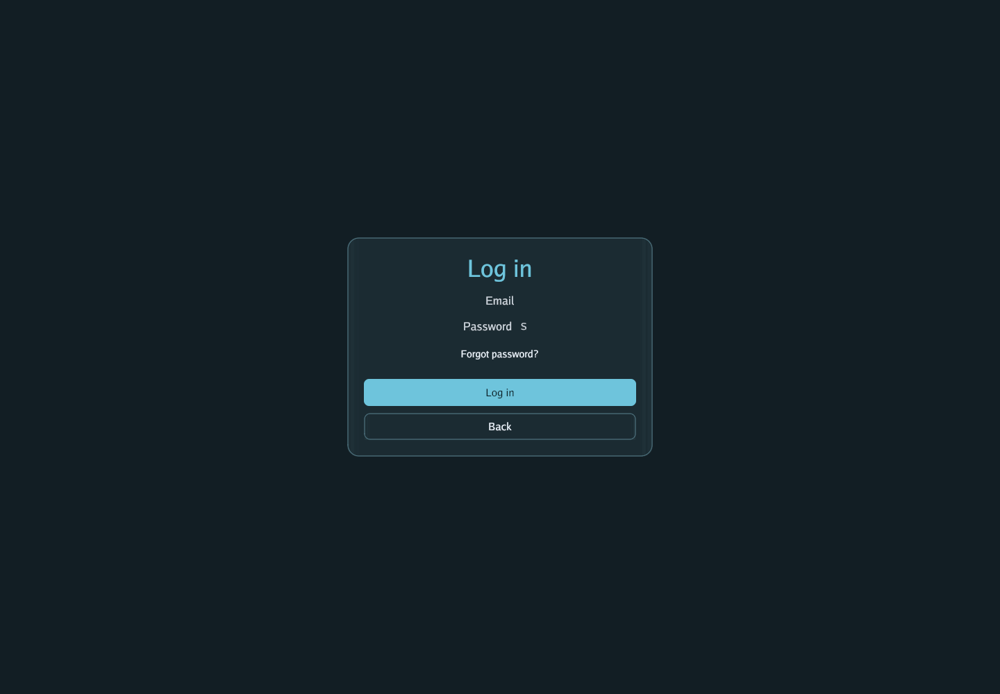
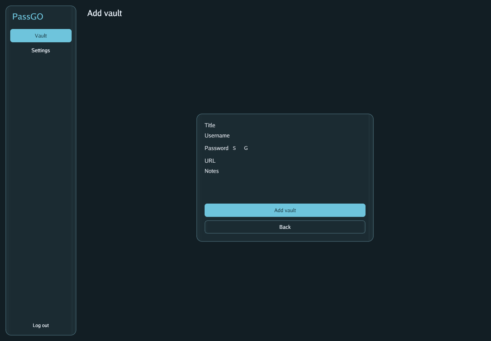
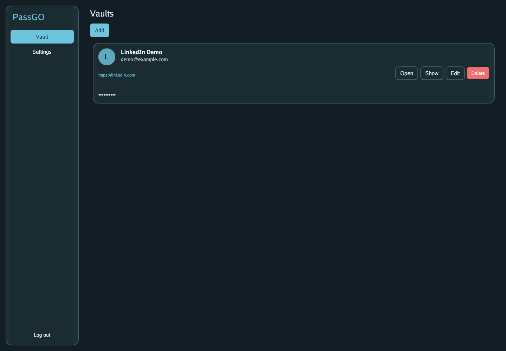
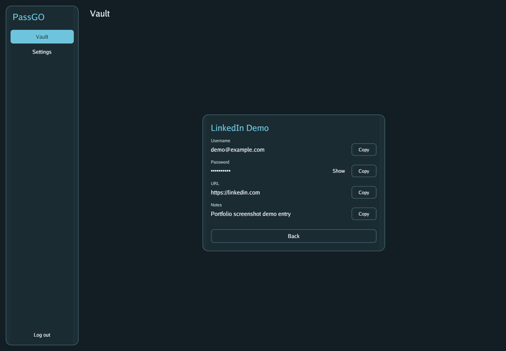
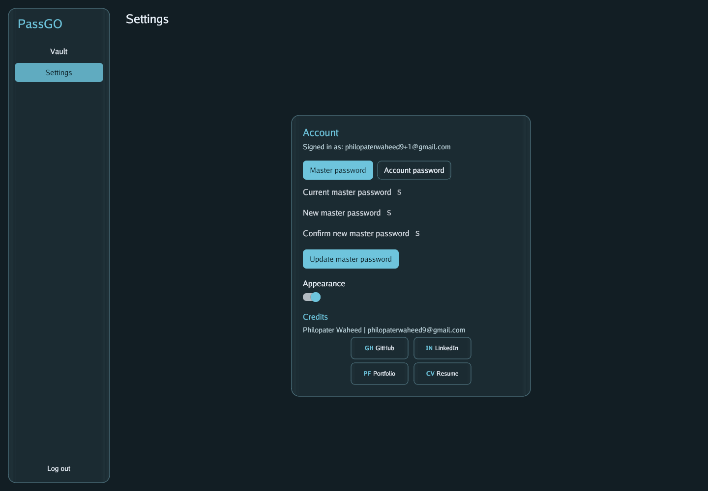

<p align="center">
  
</p>

# passGo

passGo is a full-stack password manager written in Go, built to show practical backend engineering, secure data handling, and cross-platform product development in one focused application.

The project combines a Gin API, MongoDB persistence, Supabase-backed authentication, encrypted vault storage, and a Gio frontend that can be built for desktop, web/WASM, Android, and iOS. It is intentionally more than a CRUD demo: the app handles account lifecycle, email verification, session restore, vault encryption, API limits, and release artifacts.

## What This Demonstrates

- End-to-end Go application development across backend services and GUI clients
- Security-conscious design using AES-256-GCM encryption, Argon2id master-key derivation, random vault keys, and wrapped-key storage
- Authentication workflows with Supabase signup/login, email verification, password reset, and JWT-protected API routes
- Production-minded API safeguards including rate limiting, per-user vault limits, request-size limits, CORS configuration, and ownership checks
- Cross-platform delivery through Gio, Go WebAssembly, Docker, and GitHub Actions build pipelines
- Clean project organization with separate command entry points, internal backend/frontend packages, and shared dependencies

## Features

- Register, verify email, log in, restore sessions, and reset passwords
- Create, list, inspect, update, and delete vault entries
- Encrypt sensitive vault fields before storing them in MongoDB
- Re-wrap vault keys when users change their master password
- Run the frontend against a hosted API or a local backend
- Build desktop binaries, a web/WASM bundle, Android APKs, and iOS app artifacts

## Screenshots

<table>
  <tr>
    <td width="50%">
      
      <br>
      <strong>Welcome</strong>
    </td>
    <td width="50%">
      
      <br>
      <strong>Login</strong>
    </td>
  </tr>
  <tr>
    <td width="50%">
      
      <br>
      <strong>Add vault</strong>
    </td>
    <td width="50%">
      
      <br>
      <strong>Vault list and actions</strong>
    </td>
  </tr>
  <tr>
    <td width="50%">
      
      <br>
      <strong>Vault detail</strong>
    </td>
    <td width="50%">
      
      <br>
      <strong>Settings</strong>
    </td>
  </tr>
</table>

## Tech Stack

| Area | Tools |
| --- | --- |
| Backend | Go, Gin, MongoDB, Supabase Auth, JWT |
| Frontend | Go, Gio, WebAssembly |
| Security | AES-256-GCM, Argon2id, random salts/nonces, wrapped vault keys |
| Infrastructure | Docker, GitHub Actions, Vercel-compatible web assets |

## Project Structure

```text
passGO/
├── cmd/
│   ├── backend/        # Gin API entry point
│   └── frontend/       # Gio app entry point
├── internal/
│   ├── backend/        # Auth, config, crypto, database, handlers, middleware, models
│   └── frontend/       # API client, pages, state, storage, UI, vault mapping
├── web/                # Web/WASM frontend assets
├── dist/               # Generated release artifacts
├── Dockerfile          # Backend container image
├── Makefile            # Web and Windows build helpers
├── go.mod
└── README.md
```

## Getting Started

### Prerequisites

- Go 1.24.10 or newer compatible Go 1.24 release
- MongoDB for local backend development
- Supabase project credentials for authentication flows
- Redis or Upstash Redis if you want API rate limiting enabled
- Linux GUI builds may require Gio system libraries such as `libxkbcommon-dev`, Wayland/X11 dev packages, OpenGL/EGL packages, and related desktop dependencies

### Configuration

Create a `.env` file or export the variables needed for your environment.

| Variable | Default | Purpose |
| --- | --- | --- |
| `PORT` | `8080` | Backend HTTP port |
| `ENVIRONMENT` | `development` | Runtime environment label |
| `JWT_SECRET` | empty | Secret used to sign JWTs |
| `JWT_EXPIRATION_HOURS` | `24` | JWT lifetime |
| `MONGO_URI` | `mongodb://localhost:27017` | MongoDB connection string |
| `MONGO_DATABASE` | `passgo` | MongoDB database name |
| `SUPABASE_URL` | empty | Supabase project URL |
| `SUPABASE_API_KEY` | empty | Supabase API key |
| `PASSGO_PUBLIC_BASE_URL` | empty | Public URL used in auth/reset flows |
| `PASSGO_API_BASE_URL` | `https://passgo.servebeer.com` | API base URL used by the frontend |
| `UPSTASH_REDIS_URL` / `REDIS_URL` | empty | Optional Redis URL for rate limiting |
| `RATE_LIMIT_REQUESTS` | `20` | Requests allowed per rate-limit window |
| `RATE_LIMIT_WINDOW_SECONDS` | `60` | Rate-limit window size |
| `MAX_VAULTS_PER_USER` | `50` | Maximum vault entries per user; set `0` to disable |
| `MAX_VAULT_DATA_BYTES` | `16384` | Maximum vault payload size; set `0` to disable |

### Run Locally

Start the backend:

```bash
go run ./cmd/backend
```

Start the frontend:

```bash
PASSGO_API_BASE_URL=http://localhost:8080 go run ./cmd/frontend
```

The frontend defaults to the hosted API, so set `PASSGO_API_BASE_URL` when testing a local backend.

## Build Commands

Backend binary:

```bash
go build -o passgo-backend ./cmd/backend
```

Desktop frontend:

```bash
go build -o passGo ./cmd/frontend
```

Web/WASM frontend:

```bash
make build-web
```

Windows frontend package:

```bash
make build-windows
```

Backend Docker image:

```bash
docker build -t passgo-backend .
docker run --env-file .env -p 8080:8080 passgo-backend
```

## Quality Checks

```bash
go test ./...
go vet ./...
```

## API Overview

Public auth routes live under `/api/auth` and include signup, login, email verification, token refresh, forgot password, and password update flows.

Authenticated vault routes live under `/api/vaults` and require a bearer token. Vault operations that need encryption or decryption also use the `X-Master-Password` header so the backend can derive the master key and unwrap the user's vault key for that request.

## Why I Built It

I built passGo to practice the kind of engineering work I want to do professionally: shipping useful software, thinking carefully about security boundaries, and connecting backend systems to a real user interface. It reflects my ability to learn quickly, structure a codebase, work across the stack, and turn an idea into something deployable.

## License

MIT License. See [LICENSE](LICENSE) for details.
